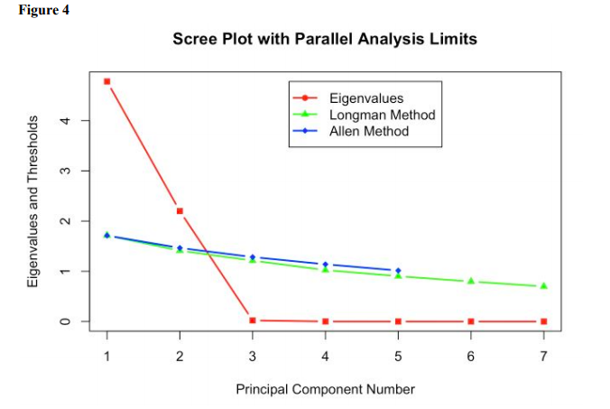

# Multivariate_Final_Report

## Introduction: The COVID-19 Pandemic

As SARS-CoV-2, more commonly referred to as COVID-19, proliferated to grip all
corners of the country, governors scrambled to implement stay-at-home orders and quarantine
directives as positive test cases skyrocketed. As of April 21, 2020, there are 824,698 confirmed
cases in the United States and 45,297 deaths as a result of the virus (Centers for Disease Control
and Protection 2020). Due to the rapid spread of the virus, hospitals all across the nation have
seen the number of patients increase exponentially; in particular, hospitals in densely-populated
urban areas such as Los Angeles and New York City are seeing their hospitals flood with sick
patients, with the end of the pandemic nowhere near in sight.

As a result, many health experts and scientists pushed measures to stop the rampant
spread of the disease; some of these include constant sterilization through hand soap or hand
sanitizer and “social distancing,” where people are encouraged to maintain six feet worth of
distance between others in public. This is largely an effort to “flatten the curve” or reduce the
peak number of infections so that the healthcare industry will not be overwhelmed.

Even with these efforts, however, health care systems across the country are struggling to
meet the needs of all their patients; intensive care unit beds are going scarce, doctors are
desperately needed, and the growth of the virus is steadily continuing. As a result, I chose to look
at the abilities of each of the 50 states, Puerto Rico, and Washington D.C. to handle the load of
COVID-19 in the near future.

## Design and Primary Questions:

Specifically, I am interested in looking at the amount of current cases each state and
territory has, along with other facts revolving around available Intensive Care Unit beds and
projected growth of the virus in order to look at the measures each state would theoretically have
to undergo to handle the amount of patients. Through this paper, I plan to delve into the
following research topics: the extent to which markers such as available Intensive Care Unit beds
and Projected Hospitalized Individuals offer redundant information, and how this can be
conveyed more effectively using Principal Components Analysis; the amount of variation in
ability to handle the projected growth of the coronavirus pandemic across states and territories in
the United States through Cluster Analysis; and the presence of underlying factors that explain
the markers of the hospital data through Factor Analysis.

## Data:
My dataset, which I borrowed from globalepidemic.org, focuses on the hospital capacity
per state and territory in the United State during the COVID-19 pandemic (Jha). This dataset is
based on a predictive model of 306 U.S. Hospital markets across all 50 states and additional
territories. This particular model was developed by an experienced group of health system
researchers at Harvard Global Health Institute and the Harvard T.H. Chan School of Public
Health.

Although the dataset contains more than 30 variables, I chose to focus on seven particular
variables: Total Intensive Care Unit Beds, Projected Infected Individuals, Projected Hospitalized
Individuals, Percentage of Total ICU Beds Needed in Six Months, Percentage of Total ICU Beds
Needed in Twelve Months, and Percentage of Total ICU Beds Needed in Eighteen Months. The
Total Intensive Care Unit Beds variable indicates the count of all ICU beds within an HRR that
are set up and staffed. Total Available ICU beds is the number of unoccupied ICU beds on
average. The Projected Infected Individuals variable states the amount of individuals over the
age of 18 that are expected to get infected with COVID-19 over the course of the entire
pandemic. The Projected Hospitalized Individuals is similar in that it states the amount of
individuals over the age of 18 that are expected to get hospitalized due to COVID-19 over the
course of the entire pandemic. Lastly, the Percentage of Total ICU Beds Needed, X months
variables indicate how many ICU beds would need to be available to care for all patients
requiring hospital care within X months. All of the variables are quantitative.

I used histograms and normal quantile plots to examine all seven variables. I decided to
log Total ICU Beds, Available ICU Beds, Projected Infected Individuals, and Projected
Hospitalized Individuals due to the magnitude of those variables, their means, and standard
deviations relative to the other variables. I examined the distributions for my variables again, and
these distributions were much closer to normal after examining their respective normal quantile
plots. However, univariate normal distributions do not guarantee a multivariate normal
distribution, so I also used a chi-square quantile plot test (results are displayed in Figure 1 below)

As evidenced by this Chi-Square Quantile plot, my transformed data is not perfectly normal, but
it is close enough where I feel confident to move forward with my data analysis.

## Descriptive Plots, Summary Statistics + Multivariate Analysis:

### Section 1: Principal Components Analysis

While some of the variables did not have the strongest correlations, I still felt there was
enough correlation between the seven variables to proceed with Principal Components Analysis.
In particular, the percentage of Total Intensive Care Unit Beds Needed in Six, Twelve, and
Eighteen months had strong correlations and the logarithms of Projected Infected and
Hospitalized Individuals as well as Total ICU Beds and Available ICU Beds had strong
correlations.

Table 2 shows that in order to explain 99% of the variance in my data, I would only need
the first two principal components. Moreover, we can see that the first two eigenvalues are the
only values greater than 1.

Now, I conduct Parallel Analysis, which is possible since my data has a multivariate
normal distribution. This is to determine which components are statistically significant, using the
Longman and Allen methods.

Table 3 and Figure 4 that the first two components are significant, since only their
eigenvalues are greater than the thresholds. This reinforces what we already found earlier.

For the first two components, which are of primary focus, Comp 1 has positive
correlations with the Percentage of Total ICU Beds needed in 6, 12, and 18 months but has
negative correlations with the log variables of Available ICU Beds, Projected Hospitalized
Individuals, Projected Infected Individuals, and Total ICU beds. The values with largest
magnitude, which are Available ICU Beds and Total ICU beds, lead to the belief that Component
one is picking up on the variation in incapability to take in sick patients for hospitals in terms of
beds. Component two, which has positive correlations with all the variables, is picking up on the
variation in the projected capacity of the hospitals based on health care system models.

Looking at figure 5, which is the biplot of the first two principal components, the bottom
and left-side axes are the principal component scores for the first and second components,
respectively. The right-side and top axes are the loading coefficients for the principal
components. There seems to be more spread in the direction of Comp2 than Comp1. The loose
clustering indicates that the 50 states and additional territories tend to be different across the 7
variables. This indicates that although a state might have a lot of projected infected individuals,
for example, there is variation on how many ICU beds they might need in the coming months.
Finally, I created a confidence ellipse plot, to test for outliers in Comp1 and Comp2.

Looking at the outliers, most of the outliers come from the direction of the second
principal component with the exception of Vermont. California, Washington D.C., and Hawaii
all seem to be projected to be unable to handle the coronavirus load coming in the coming
months, which is because this is what Component 2 was primarily loaded on. Vermont on the
other hand might have an extreme shortage of ICU beds that are available compared to other
states. Considering that Vermont is much less populated than the other outliers, I hypothesize
that this might be due to the large elderly population, but this point could use more exploration.

To read on Cluster and Factor Analysis, please look at the PDF in the repository.

## Conclusions and Discussion:

Based on our analysis conducted above, we examined the impact of the COVID-19
pandemic on the 50 U.S. states and the additional territories.
Using Principal Components Analysis, we were able to reduce the dimensionality of the
dataset in the first and second most directions of maximum variability. While doing this, we
were able to see which states were outliers compared to others; one notable observation was that
Vermont’s healthcare system is quickly projected to become overwhelmed, which might be due
to the large eldery and retired population residing there. In cluster analysis, we were able to
group states based on the projected severity of COVID-19 and their healthcare systems’ abilities
to combat the virus. Through cluster analysis, we observed that there were around three different
situations that a state could be in. Large and densely-populated states such as NY and CA are
struggling to contain the outbreak and hospitalize patients. Next, there are middle-of-the-pack
states that are seeing cases of the virus, but not to the extent of larger states. Lastly, there are
sparsely populated states such as Idaho that are not seeing rapid proliferation of the virus.
Lastly, using Factor analysis, we were able to see that the two prominent factors
explaining our variables were the projected infections and hospitalizations due to COVID-19 and
also hospital capacity based on predicted models of the pandemic.
